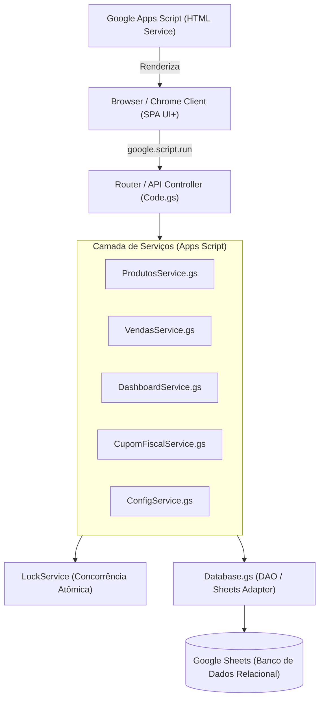

# Mercadinho Inteligente — architecture.md

## Visão Arquitetural

Arquitetura Serverless baseada no ecossistema **Google Apps Script** (GAS) com **Google Sheets** como banco de dados transacional e **Apps Script HTML Service** como camada de apresentação SPA (*Single Page Application*).



## Containers e Arquivos Principais

```txt
projeto_teste/
├── apps/
│   └── appscript/
│       ├── Code.gs                   ← Ponto de entrada doGet/doPost e RPC dispatcher
│       ├── Database.gs               ← Abstração de CRUD e Queries no Google Sheets
│       ├── ProdutosService.gs        ← Regras de negócio de estoque e catálogo
│       ├── VendasService.gs          ← Checkout de PDV, transação e decremento atômico
│       ├── DashboardService.gs       ← Agregação de KPIs, métricas e analytics
│       ├── CupomFiscalService.gs     ← Gerador de cupom térmico e formatação
│       ├── ConfigService.gs          ← Gestão de parâmetros do estabelecimento
│       ├── SecurityUtils.gs          ← Sanitização de entradas e proteção anti-injeção
│       ├── Index.html                ← Estrutura base da SPA (UI+)
│       ├── Styles.html               ← Design system moderno (Tailwind / CSS Vars / Glassmorphism)
│       ├── Scripts.html              ← Lógica cliente, estado reativo e chamadas RPC
│       └── PrintThermal.html         ← Template de impressão para bobina térmica (58mm/80mm)
```

## Modelo de Concorrência e Transação

- Para garantir que dois caixas não vendam o mesmo produto gerando estoque negativo, o `VendasService.gs` utiliza `LockService.getScriptLock()` com timeout de 10 segundos antes de gravar a transação nas abas `Vendas`, `ItensVenda` e atualizar a aba `Produtos`.
